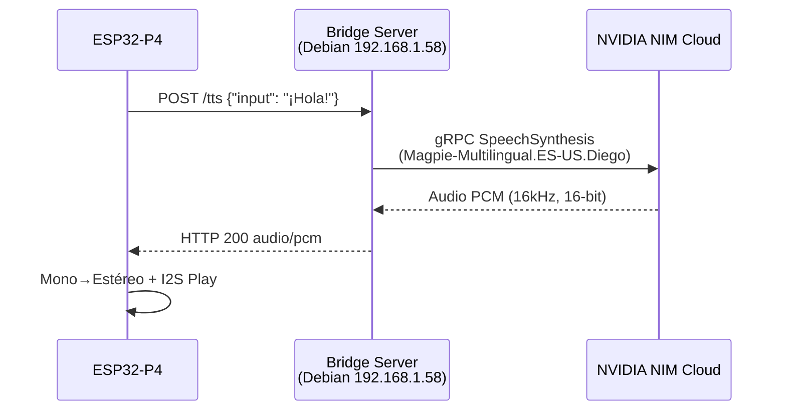

# Corrección del TTS: Migración de FastPitch → Magpie TTS Multilingual

## Resumen

El pipeline STT → LLM → TTS del asistente de voz falla en la última etapa (TTS) con un **HTTP 500**. Tras investigar:

1. Recuperé el código original del `bridge_server.py` desde la [conversación anterior](file:///C:/Users/Arondon/.gemini/antigravity-ide/brain/5648ebfc-4352-484b-9dc2-88395ca08785/bridge_server.py).
2. Descubrí que el modelo **FastPitch** (usado en el bridge) está **deprecado por NVIDIA**.
3. El `TTS_FUNCTION_ID` nunca fue configurado correctamente — quedó como `"FALTA_TTS_ID"` en el `.env` del servidor Debian.

## Análisis (Causa Raíz)

El `bridge_server.py` desplegado en `192.168.1.58:5000` tiene **dos problemas fatales**:

| # | Problema | Ubicación | Impacto |
|---|---------|-----------|---------|
| 1 | `TTS_FUNCTION_ID` = `"FALTA_TTS_ID"` (placeholder) | `.env` en Debian | gRPC rechaza la conexión → HTTP 500 |
| 2 | Modelo FastPitch está **deprecado** en NVIDIA NIM | `bridge_server.py` línea 85 | Aunque tuviera el function-id, el endpoint ya no existe |
| 3 | Voz `"es-US-Radames"` no existe en Magpie TTS | `bridge_server.py` línea 85 | Error de voz no disponible |

## Objetivo

Migrar el endpoint `/tts` del bridge server de FastPitch (deprecado) a **Magpie TTS Multilingual**, el modelo actual de NVIDIA para síntesis de voz, completando así el pipeline extremo a extremo.

## Alternativas Evaluadas

### Alternativa A: Migrar a Magpie TTS Multilingual (gRPC vía Riva) ✅ **Elegida**
- **Ventajas:** Usa la misma librería `nvidia-riva-client` que ya está instalada, soporta español (es-US), calidad de voz superior, mínimo cambio de código.
- **Desventajas:** Requiere obtener el `function-id` de Magpie desde build.nvidia.com.

### Alternativa B: Usar la API REST directa de Magpie TTS
- **Ventajas:** No necesita gRPC ni `nvidia-riva-client`.
- **Desventajas:** Endpoint diferente (`/v1/audio/synthesize`), requiere reescribir más código, la latencia es potencialmente mayor para streaming.

### Alternativa C: Usar un TTS alternativo (Google TTS, Edge TTS)
- **Ventajas:** Gratuito, sin depender de NVIDIA.
- **Desventajas:** Sale del ecosistema NVIDIA, calidad variable para español, introduce otra dependencia.

## User Review Required

> [!IMPORTANT]
> **Se necesita el `function-id` de Magpie TTS.**
> Para obtenerlo, necesitas ir a [build.nvidia.com/nvidia/magpie-tts-multilingual](https://build.nvidia.com/nvidia/magpie-tts-multilingual), hacer click en **"Try API"** → **"Python"**, y copiar el valor de `function-id` que aparece en el código de ejemplo gRPC. Se verá algo así:
> ```
> metadata_args=[["function-id", "xxxxxxxx-xxxx-xxxx-xxxx-xxxxxxxxxxxx"], ...]
> ```
> El ID exacto puede ser diferente para tu cuenta. **¿Puedes compartirlo?**
>
> Si prefieres no hacerlo ahora, puedo preparar un `bridge_server.py` actualizado con un placeholder que puedas rellenar en el archivo `.env` de Debian.

> [!WARNING]
> **API Key de TTS:** En tu archivo [API_nvidia.txt](file:///c:/Users/Arondon/Documents/ABLUTECH/AsistenteAI/DOCUMENT/API_nvidia.txt) tienes la key `nvapi-REDACTADO` etiquetada como "API nemotron-voicechat". ¿Esta es la key que usas para TTS, o necesitas generar una nueva para Magpie TTS?

## Proposed Changes

### Componente 1: Bridge Server (Debian VM)

#### [MODIFY] bridge_server.py
Actualizar el endpoint `/tts` para usar **Magpie TTS Multilingual** en vez de FastPitch:
- Cambiar `voice_name` de `"es-US-Radames"` a `"Magpie-Multilingual.ES-US.Diego"` (voz masculina en español).
- Agregar manejo de errores robusto con logs detallados.
- Agregar endpoint `/health` para diagnósticos.
- La variable de entorno `TTS_FUNCTION_ID` se leerá del `.env` como antes.

#### [MODIFY] .env (en Debian)
```env
NVIDIA_API_KEY=nvapi-REDACTADO
STT_FUNCTION_ID=REDACTADO
TTS_FUNCTION_ID=<EL_ID_QUE_NOS_PROPORCIONES>
```

### Componente 2: Script de Despliegue

#### [NEW] deploy_bridge_v2.py
Script SSH automatizado (igual que el original) para:
1. Actualizar `bridge_server.py` en `/home/ablutech/riva-bridge/`
2. Actualizar `.env` con el nuevo `TTS_FUNCTION_ID`
3. Instalar dependencias si es necesario (`pip install -U nvidia-riva-client`)
4. Reiniciar el servicio systemd `riva-bridge`

### Componente 3: Firmware (Sin cambios necesarios)

El [AsistenteAI.ino](file:///c:/Users/Arondon/Documents/ABLUTECH/AsistenteAI/AsistenteAI.ino) **no necesita cambios**. El ESP32 ya envía JSON `{"input": "texto"}` al endpoint `/tts` y espera audio PCM de vuelta. La migración es transparente desde el firmware.

---

## Arquitectura de la Solución



## Riesgos

| Riesgo | Probabilidad | Mitigación |
|--------|-------------|-----------|
| Function-id incorrecto o expirado | Media | El .env permite cambiar sin re-desplegar código |
| Voz `Magpie-Multilingual.ES-US.Diego` no disponible | Baja | El bridge listará las voces disponibles en logs al arrancar |
| Latencia alta de Magpie vs FastPitch | Baja | Magpie es el modelo recomendado actual, optimizado |
| Credenciales SSH cambiadas en Debian | Baja | Script pedirá nuevas credenciales si falla |

## Verification Plan

### Manual Verification
1. Ejecutar el script de despliegue desde Windows.
2. Verificar en Debian que el servicio `riva-bridge` está corriendo: `sudo systemctl status riva-bridge`
3. Test manual del endpoint: `curl -X POST http://192.168.1.58:5000/tts -H "Content-Type: application/json" -d '{"input":"Hola mundo"}'`
4. Ejecutar pipeline completo desde el ESP32 (enviar `1` por Serial Monitor).
5. Escuchar la voz por el altavoz.

## Próximos Pasos (Post-TTS)
Una vez que el TTS funcione:
1. Eliminar código de diagnóstico (buffer dump) del `.ino`
2. Fase 2: VAD (Voice Activity Detection) + Optimización de latencia
3. Fase 3: Interfaz LVGL en Core 1
