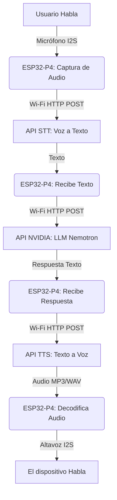

# Plan de Implementación: Asistente Virtual Estilo "Alexa" en ESP32-P4

Este documento detalla la arquitectura y los pasos necesarios para convertir el módulo HMI JC4880P443C en un asistente inteligente interactivo, utilizando su hardware integrado (Micrófono, Altavoz, Pantalla) y la API de NVIDIA para el razonamiento.

## 1. Arquitectura del Sistema

Para lograr un asistente de voz fluido, el flujo de datos debe dividirse en 4 etapas principales. Dado que el LLM de NVIDIA procesa texto, necesitamos añadir capacidades de conversión de voz.

### Componentes de Software requeridos:
1.  **Conectividad:** Stack de Wi-Fi y Cliente HTTP Seguro (HTTPS) para llamar a las APIs.
2.  **Audio:** Drivers I2S para leer el micrófono de la placa y escribir en el puerto del altavoz externo.
3.  **UI (Pantalla):** Una interfaz gráfica en **LVGL** que muestre el estado del asistente (Ej: Un círculo que pulsa al escuchar, gira al pensar y se expande al hablar).
4.  **APIs Externas (Ecosistema NVIDIA 100%):**
    *   **LLM (Razonamiento):** Nemotron-3 (`api.nvidia.com/v1/chat/completions`).
    *   **STT (Voz a Texto):** NVIDIA Parakeet/Canary (`api.nvidia.com/v1/audio/transcriptions`).
    *   **TTS (Texto a Voz):** NVIDIA Riva/MagpieTTS (`api.nvidia.com/v1/audio/speech`).

---

## 2. Preguntas Abiertas (User Review Required)

Antes de empezar a escribir el código, necesito tu retroalimentación en estas decisiones críticas de diseño:

> [!IMPORTANT]  
> **1. Activación del Asistente (Wake-up)**
> ¿Cómo quieres que el asistente empiece a escucharte?
> *   **Opción A (Recomendada para empezar):** Un botón táctil en la pantalla o botón físico. Al tocarlo, graba. Es más fácil y requiere menos memoria continua.
> *   **Opción B (Estilo Alexa Real):** Palabra de activación continua (Ej: "Oye ESP"). Requiere usar la librería `esp-sr` de Espressif para escuchar offline todo el tiempo. Es más avanzado.

> [!IMPORTANT]
> **2. Proveedores de Voz (STT / TTS)**
> Necesitaremos claves de API para entender la voz y generar voz. 
> *   ¿Tienes ya cuentas en plataformas como OpenAI, Groq o Google Cloud para usar sus servicios de voz? Si no, te recomendaré las opciones más económicas/gratuitas para empezar.

> [!WARNING]
> **3. Memoria y Streaming**
> Trabajar con audio en microcontroladores consume mucha memoria. Usaremos los 32MB de PSRAM del ESP32-P4 para guardar la grabación en formato `.wav` antes de enviarla, y para recibir el audio de respuesta antes de reproducirlo. ¿Dispones de una tarjeta MicroSD o usaremos solo la memoria RAM interna?

---

## 3. Fases de Desarrollo Propuestas

Si estás de acuerdo con la dirección, construiremos esto paso a paso para asegurar que cada pieza funcione bien:

### Fase 1: Pruebas de Hardware Base (Fundamentos)
- [ ] Configurar el proyecto en Arduino IDE / ESP-IDF.
- [ ] Conectar al Wi-Fi (ESP32-C6 a través de ESP32-P4).
- [ ] Prueba de Micrófono: Grabar 3 segundos de audio y guardarlo en memoria RAM.
- [ ] Prueba de Altavoz: Reproducir un sonido de prueba desde la memoria.

### Fase 2: Interfaz Gráfica (UI)
- [ ] Configurar la pantalla ST7701S y LVGL.
- [ ] Crear las 4 vistas principales: `Reposo`, `Escuchando`, `Procesando` (NVIDIA) y `Hablando`.

### Fase 3: Integración de APIs en la Nube
- [ ] Crear cliente HTTP para **STT** (Enviar audio, recibir texto).
- [ ] Adaptar el script de **NVIDIA** a C++ para enviar el texto recibido y obtener la respuesta.
- [ ] Crear cliente HTTP para **TTS** (Enviar respuesta de NVIDIA, recibir y reproducir audio).

### Fase 4: Bucle Principal y Ensamblaje
- [ ] Unir todo en una máquina de estados finitos (State Machine).
- [ ] Optimizar la latencia (Streaming de audio si es posible, en lugar de descargar todo antes de hablar).

## 4. Plan de Verificación
*   **Prueba de Latencia:** Mediremos el tiempo desde que el usuario termina de hablar hasta que el dispositivo empieza a responder. (Meta: < 3 segundos).
*   **Gestión de Memoria:** Monitorear fugas de memoria en la PSRAM tras múltiples interacciones.
*   **UX Visual:** Asegurar que la pantalla no se congele (LVGL) mientras el dispositivo hace peticiones HTTPS pesadas, usando tareas de FreeRTOS separadas (Multithreading).
