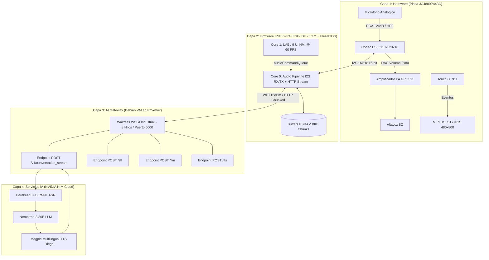

# 🚀 Edge AI Voice Assistant (ESP32-P4 + Debian Proxmox Gateway + NVIDIA NIM)

-orange?style=for-the-badge&logo=espressif)


Asistente de voz inteligente de grado industrial con pantalla táctil, diseñado sobre el microcontrolador de alto rendimiento **ESP32-P4 (Dual-Core RISC-V @ 360/400MHz)** con conectividad inalámbrica gestionada por co-procesador **ESP32-C6 (SDIO)**. El sistema delega el procesamiento pesado de Inteligencia Artificial (ASR, LLM, TTS) a los servicios de **NVIDIA NIM** en la nube, interconectados mediante un Gateway industrial seguro desplegado en una máquina virtual **Debian sobre Proxmox**.

---

## 📚 Documentación Canónica del Proyecto

Para mantener el principio de *Single Source of Truth* y máxima claridad técnica, consulta la documentación oficial en la carpeta `docs/`:

| Documento | Descripción |
|---|---|
| 🏛️ **[docs/ARCHITECTURE.md](docs/ARCHITECTURE.md)** | Arquitectura canónica en 4 capas, asignación de núcleos FreeRTOS y flujo de memoria. |
| 📘 **[docs/BITACORA_EVOLUCION_SISTEMA.md](docs/BITACORA_EVOLUCION_SISTEMA.md)** | Bitácora maestra, post-mortems de ingeniería, análisis de causa raíz (RCA) y ADRs. |
| 🔌 **[docs/HARDWARE_PINOUT_JC4880P443C.md](docs/HARDWARE_PINOUT_JC4880P443C.md)** | Mapeo oficial de pines (I2S, I2C, MIPI DSI, GT911, SDIO, Amplificador PA). |
| 🚀 **[docs/ROADMAP_Y_ESTADO_ACTUAL.md](docs/ROADMAP_Y_ESTADO_ACTUAL.md)** | Estado de madurez del proyecto, matriz de subsistemas y tareas de las Fases 3 y 4. |

---

## 🏛️ Arquitectura del Sistema (Las 4 Capas de Ingeniería)



---

## ⚡ Guía de Instalación y Operación

### 1. Configuración de Credenciales
> [!IMPORTANT]
> **Nunca subas secretos al repositorio.** Todos los archivos con claves están protegidos en `.gitignore`.

1. **Firmware:** Copia `main/config.h.example` a `main/config.h` y ajusta tu SSID de WiFi y URL del Gateway:
   ```c
   #define WIFI_SSID "TuRedWiFi"
   #define WIFI_PASS "TuPassword"
   #define BRIDGE_BASE_URL "http://192.168.1.58:5000"
   ```
2. **Gateway:** En la VM Debian, copia `bridge.env.example` a `bridge.env` y coloca tu `NVIDIA_API_KEY`.

### 2. Compilación y Flasheo del Firmware (ESP-IDF v5.3.2 LTS)
En tu terminal de Windows / PowerShell con el entorno ESP-IDF cargado:
```powershell
# Activar entorno ESP-IDF
. C:\Espressif\frameworks\esp-idf-v5.3.2\export.ps1

# Compilar proyecto
idf.py build

# Flashear y monitorear puerto serie (asegúrate de cerrar PuTTY primero)
idf.py -p COM3 flash monitor
```

### 3. Servicio Gateway (Debian VM en Proxmox)
En el servidor Debian (`192.168.1.58`):
```bash
# Iniciar / reiniciar servicio del puente
sudo systemctl restart riva-bridge

# Monitorear logs en vivo
journalctl -u riva-bridge -f
```

---

## 📜 Licencia y Autoría
Diseñado y orquestado bajo estándares estrictos del **Chief AI Engineering Officer (CAEO)**.  
Consulta el archivo `LICENSE.txt` para términos de uso.
