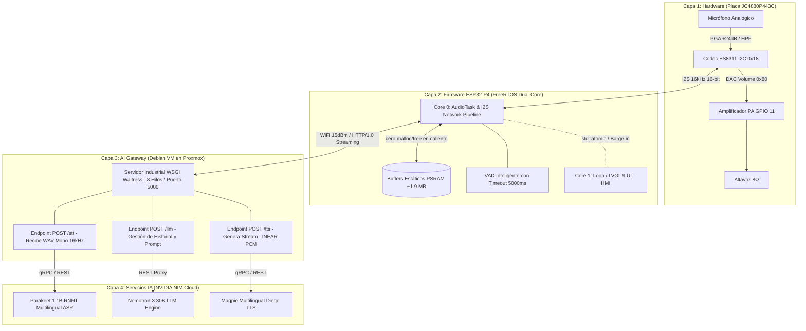

# 🚀 Edge AI Voice Assistant (ESP32-P4 + Proxmox Gateway + NVIDIA NIM)

-orange?style=for-the-badge&logo=espressif)


-success?style=for-the-badge)

Asistente de voz inteligente de grado industrial con pantalla táctil, diseñado sobre el microcontrolador de alto rendimiento **ESP32-P4 (Dual-Core RISC-V 400MHz)** con conectividad inalámbrica gestionada por co-procesador **ESP32-C6**. El sistema delega el procesamiento pesado de Inteligencia Artificial (ASR, LLM, TTS) a los servicios de **NVIDIA NIM** en la nube, interconectados mediante un Gateway industrial seguro desplegado en una máquina virtual **Debian sobre Proxmox**.

---

## 🏛️ Arquitectura del Sistema (Las 4 Capas de Ingeniería)

La filosofía de diseño adopta un desacoplamiento estricto en 4 capas de abstracción para garantizar escalabilidad militar, baja latencia y estabilidad energética:



> [!NOTE]
> **Rendimiento Certificado:** El sistema alcanza una latencia percibida por el usuario (*Time-to-First-Audio / TTFA*) de **~2.15 segundos**, operando de forma continua por streaming PCM sin caídas de tensión por consumo de corriente (Protección Anti-Brownout BOD) ni fragmentación en memoria PSRAM.

---

## 🛠️ Especificaciones de Hardware y Pinout (JC4880P443C)

El desarrollo está ajustado con precisión milimétrica al perfil de pines del fabricante para el procesador **ESP32-P4**:

| Periférico / Función | Pines GPIO / Dirección | Especificaciones Técnicas y Notas |
| :--- | :--- | :--- |
| **Codec de Audio (I2C)** | `IIC_DATA: 7`, `IIC_CLK: 8` (Dir: `0x18`) | ES8311. **Requiere MCLK continuo activo** antes de inicializar por bus I2C. |
| **Bus I2S (Audio Digital)**| `MCLK: 13`, `BCLK: 12`, `LRCK: 10`, `DOUT: 9`, `DIN: 48` | Muestreo a **16 kHz, 16-bit, Estéreo Estándar Philips**. |
| **Amplificador de Audio** | `PA_PIN: 11` | Debe fijarse en HIGH (`digitalWrite(PA_PIN, HIGH)`) para desmutear el altavoz de 8Ω. |
| **Memoria PSRAM** | Integrado en Hardware | 32 MB de alta velocidad. Los buffers estáticos ocupan **~1.9 MB** asignados al boot. |
| **Pantalla Táctil HMI** | Interfaz MIPI DSI LCD (480 × 800 px) | Reservada exclusivamente para renderizado **LVGL 9 en Core 1** con Double Buffering. |

---

## 💎 Innovaciones y Solidez Arquitectónica

1. **Estabilización Energética Anti-Brownout (BOD):** En microcontroladores operando RF WiFi y amplificadores analógicos de potencia en simultáneo, se calibró la potencia del transmisor ESP32-C6 a `WIFI_POWER_15dBm` (~31 mW) y el mezclador DAC a `0x32 = 0x80` (~60% volumen). Esto impide picos de consumo transitorios (>800 mA) que tumban el voltaje en puertos USB de computadoras.
2. **Resiliencia de Memoria en PSRAM:** Eliminación de los ciclos `malloc`/`free` continuos durante las capturas de voz mediante asignación estática global (`psramStereoBuffer`, `psramMonoBuffer`, `psramPayloadBuffer`), garantizando cero fragmentación en ejecuciones continuas 24/7.
3. **VAD Inteligente y Ahorro de Nube:** Algoritmo de detección de actividad vocal por amplitud con temporización diferencial `millis()` real. Incorpora un **timeout de inactividad temprano (5000 ms)** al inicio: si el operador presiona el disparador y no habla, la captura aborta instantáneamente, ahorrando datos, CPU y evitando alucinaciones del ASR Parakeet.
4. **Streaming de Audio PCM Puro (Sin Estática):** El servidor puente en Proxmox inyecta las respuestas de Magpie TTS en formato `LINEAR_PCM` crudo y el firmware consume el stream sobre HTTP/1.0, eliminando interferencias y chasquidos electrostáticos provocados por cabeceras WAV o Chunked Encoding.
5. **Concurrencia Atómica Anti-Race Conditions:** Señal de interrupción instantánea de audio por usuario (*Barge-in*) controlada a nivel de hardware por la primitiva C++ `std::atomic<bool>`.

---

## 📂 Estructura del Repositorio

```text
AsistenteAI/
├── .agents/skills/      # Skills del Arquitecto IA (Reglas ESP32-P4 HMI Master y Pinout)
├── DOCUMENT/            # Documentación profunda, diagramas CAD, datasheets y estados (ADRs)
├── AsistenteAI.ino      # Código principal del microcontrolador ESP32-P4 (FreeRTOS Core 0 y 1)
├── ES8311_Init.h        # Controlador nativo y registros I2C para el codec de audio ES8311
├── bridge_server.py     # Servidor Gateway WSGI (Waitress) v2.2 para desplegar en Debian VM
├── deploy_bridge_v2.py  # Script automatizado para redespegue del Gateway por SSH en Proxmox
├── config.h.example     # Plantilla segura de credenciales locales WiFi y Bridge URL
├── bridge.env.example   # Plantilla segura de tokens NVIDIA NIM y claves para Debian
├── AVANCE_DEL_PROYECTO.md # Bitácora de sesiones e hitos operativos consolidados
├── TODO.md              # Lista técnica de tareas clasificada por prioridad de ingeniería
└── README.md            # Documentación maestra del ecosistema
```

---

## ⚡ Guía de Instalación y Compilación Rápida

### 1. Saneamiento y Seguridad Criptográfica
> [!IMPORTANT]
> **Nunca subas secretos al repositorio ni expongas tus llaves en texto plano.** Todos los archivos de configuración en caliente (`config.h`, `bridge.env`, `.env`) están estrictamente ignorados por `.gitignore`.

1. Copia la plantilla del firmware:
   ```bash
   cp config.h.example config.h
   ```
   *Edita `config.h` e introduce tu SSID de WiFi, contraseña y la URL del servidor Proxmox (ej. `http://192.168.1.100:5000`).*

2. Copia la plantilla de la máquina virtual:
   ```bash
   cp bridge.env.example bridge.env
   ```
   *Edita `bridge.env` colocando tus API Keys de NVIDIA NIM (`NVIDIA_API_KEY`) obtenidas en [build.nvidia.com](https://build.nvidia.com).*

### 2. Compilación del Firmware (ESP32-P4)
El repositorio cuenta con el ejecutable local de `arduino-cli` en entornos Windows para compilación automatizada e instantánea sin abrir entornos pesados:

```powershell
# Verificar las placas conectadas y puertos COM
.\arduino-cli.exe board list

# Compilar el firmware con el objetivo FQBN nativo del ESP32-P4 Dev Module
.\arduino-cli.exe compile --fqbn esp32:esp32:esp32p4 . --warnings default
```
*También puedes compilar abriendo `AsistenteAI.ino` en **Arduino IDE 2.3+** (con el Core ESP32 versión 3.x de Espressif instalado).*

### 3. Despliegue del AI Gateway (VM Debian en Proxmox)
En tu servidor de infraestructura local (Debian sobre Proxmox), instala las dependencias e inicializa el servidor industrial:

```bash
# Instalar dependencias Python (Waitress WSGI, Requests, gRPC, etc.)
pip install waitress requests grpcio

# Iniciar el servidor puente de alto rendimiento en el puerto 5000 (8 hilos concurrentes)
python3 bridge_server.py
```

---

## 📊 Bitácora y Próximas Fases (Roadmap)

- **[x] FASE 1 & 2: Pipeline E2E y Robustez (100% COMPLETADA)**  
  Certificación del flujo de audio Estéreo $\to$ Mono $\to$ Parakeet ASR $\to$ Nemotron-3 LLM $\to$ Magpie TTS con streaming PCM puro y sin fallos eléctricos (5 de Agosto 2026).
- **[ ] FASE 3: Interfaz Gráfica Premium LVGL 9 (En Progreso / Siguiente Frontera)**  
  Implementación del motor gráfico en la pantalla MIPI DSI sobre **Core 1** a 60 FPS inamovibles (Double Buffer en PSRAM) con estados visuales dinámicos: *Reposo (Clock), Escuchando (Waveform), Pensando (Spinner) y Hablando (Espectro)*, aplicando sincronización por semáforo `xGuiSemaphore` y nomenclatura estricta (*"configuración"*).
- **[ ] FASE 4: Industrialización y Producción**  
  Migración de Arduino IDE a componentes nativos en **ESP-IDF puro**, streaming WebSocket/gRPC para latencia < 1.5s y servicio de actualización remota **OTA** con doble partición A/B.

---

## 📜 Licencia y Autoría
Diseñado y orquestado bajo estándares estrictos del **Chief AI Engineering Officer (CAEO)**.  
Consulta el archivo `LICENSE.txt` en el repositorio para términos de uso e integración industrial.
