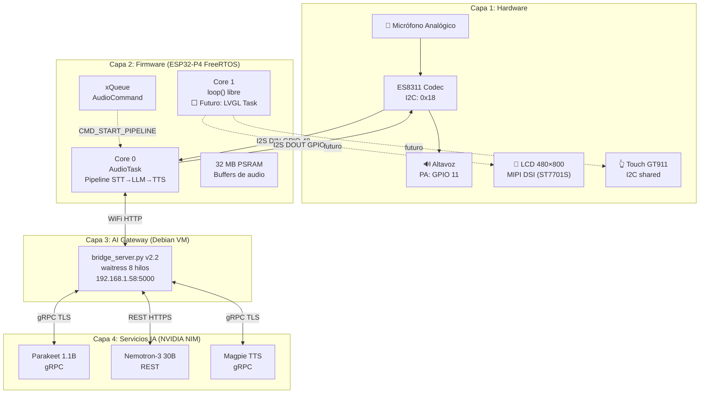

# Auditoría Completa — Edge AI Voice Assistant

**Fecha:** 4 de Agosto de 2026  
**Rol:** Lead Embedded AI Systems Engineer (CAEO)  
**Scope:** Todos los archivos del workspace `AsistenteAI`

---

## 1. Resumen Ejecutivo

El proyecto Edge AI Voice Assistant está en estado **INTERMEDIO AVANZADO**. El pipeline de voz de extremo a extremo (Mic → ES8311 → ESP32-P4 → WiFi → Bridge Debian → NVIDIA NIM → retorno TTS) fue validado con éxito el 28 de Julio de 2026. Desde entonces, se ha consolidado la seguridad (secrets fuera de git), se ha migrado el LLM al bridge server, y se han implementado mejoras parciales de robustez (H3/H4). El proyecto se encuentra en la **transición entre la Fase 2 (Robustez) y la Fase 3 (UI LVGL + Wake Word)**, con 4 tareas HIGH y 6 MEDIUM pendientes antes de poder abordar la interfaz gráfica con confianza.

> [!IMPORTANT]
> El hito más crítico logrado —primer audio transcrito por NVIDIA Parakeet— valida que la arquitectura de 4 capas (Hardware → Firmware → Gateway → IA) es técnicamente viable. El riesgo dominante es la **latencia total del pipeline** (estimada 5–15 s, objetivo < 3 s) y la **fragmentación de PSRAM** por ciclos malloc/free de ~1.9 MB.

---

## 2. Objetivo de esta Auditoría

Mapear exhaustivamente:
1. **Qué está hecho** y funciona en producción.
2. **Qué falta** según el backlog priorizado (TODO.md).
3. **Dónde están los cuellos de botella** técnicos (memoria, latencia, seguridad, deuda técnica).
4. Verificar conformidad con las reglas del skill `esp32_p4_hmi_master` (incluyendo nomenclatura UI: "configuración", no "ajustes").

---

## 3. Análisis del Estado Actual

### 3.1 Mapa de Completitud por Capa

| Capa | Componente | Estado | Detalle |
|------|-----------|--------|---------|
| **Capa 1: Hardware** | ESP32-P4 (JC4880P443C) | ✅ 100% | Pines I2S/I2C/PA identificados y verificados contra 4 fuentes |
| | ES8311 Codec | ✅ 100% | HPF, ganancia +24dB, secuencia ESP-ADF completa |
| | Pantalla MIPI DSI 480×800 | ⬜ 0% | Sin código LVGL aún; solo referencia de pinout (RST=5, BL=23) |
| | Touch GT911 | ⬜ 0% | I2C compartido con codec; INT/RST=21/22 documentados |
| | WiFi (ESP32-C6) | ✅ 95% | Funciona con auto-reconnect; falta evento de reconexión |
| **Capa 2: Firmware** | FreeRTOS multitarea | ✅ 85% | AudioTask Core 0, loop() Core 1 libre; falta LVGL task |
| | Pipeline STT | ✅ 90% | VAD por amplitud, downmix estéreo→mono, retry HTTP |
| | Pipeline LLM | ✅ 95% | Delegado al Bridge, payload mínimo `{"input": "..."}` |
| | Pipeline TTS | ✅ 90% | Streaming PCM chunked, mono→estéreo en tiempo real, barge-in |
| | LVGL UI | ⬜ 0% | Core 1 libre y reservado; sin código |
| | Wake Word | ⬜ 0% | Requiere ESP-ADF (ESP-SR) |
| **Capa 3: AI Gateway** | bridge_server.py v2.2 | ✅ 90% | Flask + waitress, 4 endpoints, auth token, retry cold-start |
| | deploy_bridge_v2.py | 🟡 85% | Bug `f.read()` doble (M5), funcional pero frágil |
| | systemd service | ✅ 95% | Auto-restart, EnvironmentFile, waitress 8 hilos |
| **Capa 4: Servicios IA** | STT (Parakeet 1.1B) | ✅ | gRPC → bridge → ESP32 |
| | LLM (Nemotron-3 30B) | ✅ | REST → bridge → ESP32 |
| | TTS (Magpie Multilingual) | ✅ | gRPC → bridge → streaming PCM |

### 3.2 Archivos del Proyecto (Inventario Completo)

| Archivo | Líneas | Propósito | Estado |
|---------|--------|-----------|--------|
| [AsistenteAI.ino](file:///c:/Users/Arondon/Documents/ABLUTECH/AsistenteAI/AsistenteAI.ino) | 479 | Firmware principal (FreeRTOS, pipeline STT→LLM→TTS) | Activo |
| [ES8311_Init.h](file:///c:/Users/Arondon/Documents/ABLUTECH/AsistenteAI/ES8311_Init.h) | 155 | Driver codec ES8311 (I2C init + dump) | Activo |
| [config.h.example](file:///c:/Users/Arondon/Documents/ABLUTECH/AsistenteAI/config.h.example) | 26 | Plantilla de secrets del firmware | OK |
| [bridge_server.py](file:///c:/Users/Arondon/Documents/ABLUTECH/AsistenteAI/bridge_server.py) | 442 | Servidor puente Flask + waitress (v2.2) | Activo |
| [bridge.env.example](file:///c:/Users/Arondon/Documents/ABLUTECH/AsistenteAI/bridge.env.example) | 47 | Plantilla de secrets del bridge | OK |
| [deploy_bridge_v2.py](file:///c:/Users/Arondon/Documents/ABLUTECH/AsistenteAI/deploy_bridge_v2.py) | 240 | Script de despliegue SSH + systemd | Bug M5 presente |
| [TODO.md](file:///c:/Users/Arondon/Documents/ABLUTECH/AsistenteAI/TODO.md) | 91 | Backlog priorizado (CRITICAL/HIGH/MEDIUM/LOW) | Fuente de verdad |
| [AVANCE_DEL_PROYECTO.md](file:///c:/Users/Arondon/Documents/ABLUTECH/AsistenteAI/AVANCE_DEL_PROYECTO.md) | 199 | Bitácora + estado del pipeline + lecciones | Fuente de verdad |
| [analisis_dispositivo.md](file:///c:/Users/Arondon/Documents/ABLUTECH/AsistenteAI/DOCUMENT/analisis_dispositivo.md) | 71 | Análisis de hardware del JC4880P443C | Referencia |
| [project_status.md](file:///c:/Users/Arondon/Documents/ABLUTECH/AsistenteAI/DOCUMENT/project_status.md) | 45 | Estado del proyecto (⚠️ DESACTUALIZADO) | Requiere M6 |

---

## 4. Alternativas y Decisiones Arquitectónicas Tomadas

Las siguientes decisiones ya fueron validadas en producción (documentadas como ADRs pendientes en L3):

| Decisión | Alternativas Descartadas | Razón |
|----------|--------------------------|-------|
| **Bridge gRPC como proxy** | ESP32 → NVIDIA directo | ESP32 no puede pagar TLS + gRPC (memoria/CPU prohibitivos) |
| **HTTP/1.0 forzado en TTS** | HTTP/1.1 con chunked encoding | Chunked corrompía el audio PCM en el ESP32 |
| **HPF del ADC obligatorio** | Sin HPF | Mic Bias DC saturaba ADC a 32767 (regs 0x1B/0x1C) |
| **Streaming PCM puro** | WAV con cabeceras | Elimina estática; buffer TCP/LwIP se consume completo |
| **LLM en el Bridge** | LLM directo desde ESP32 | Elimina API keys del firmware + permite historial de conversación |

---

## 5. Arquitectura Actual (Diagrama de Capas)



---

## 6. Problemas Encontrados y Riesgos

### 🔴 CRÍTICOS

#### RISK-001: Fragmentación de PSRAM por ciclos malloc/free
- **Ubicación:** [recordAndTranscribe()](file:///c:/Users/Arondon/Documents/ABLUTECH/AsistenteAI/AsistenteAI.ino#L202-L347)
- **Detalle:** Cada invocación del pipeline asigna y libera **~1.9 MB** en PSRAM:
  - `stereoBuffer`: 960,000 bytes (15s × 16kHz × 4 bytes/sample estéreo)
  - `monoBuffer`: 480,000 bytes
  - `fullPayload`: variable (~500 KB+)
- **Impacto:** Después de N ciclos, la PSRAM se fragmenta. `heap_caps_malloc` podría fallar incluso con memoria libre total suficiente pero no contigua.
- **Mitigación propuesta (M1):** Asignar buffers estáticos una sola vez al arranque de `audioTask()`.

#### RISK-002: Latencia del pipeline excesiva (5–15 s estimado vs objetivo < 3 s)
- **Desglose estimado del pipeline:**

| Etapa | Latencia Estimada | Tipo |
|-------|-------------------|------|
| Grabación (VAD + silencio 1.2s) | 2–15 s | Variable |
| Upload HTTP del WAV al bridge | 0.5–1 s | Red |
| Cold-start NVIDIA gRPC (primer uso) | 0–10 s | Cloud |
| STT (Parakeet ASR) | 0.5–2 s | Cloud |
| LLM (Nemotron-3 30B) | 1–5 s | Cloud |
| TTS (Magpie, primer chunk) | 0.5–2 s | Cloud |
| Download streaming PCM | 0.2–0.5 s | Red |
| **Total (caso típico, sin cold-start)** | **~5–8 s** | — |
| **Total (peor caso, con cold-start)** | **~15–25 s** | — |

- **Cuellos de botella principales:**
  1. La grabación espera 1.2 s de silencio tras el habla (reducible a ~500 ms).
  2. El audio se envía completo POST-grabación (no hay streaming ASR).
  3. Los cold-starts de NVIDIA NIM añaden latencia impredecible.
- **Mitigación:** Tarea M4 (instrumentar latencia por etapa) es **prerrequisito** para optimizar. Tarea de streaming ASR eliminaría 50% del tiempo.

#### RISK-003: `interruptPlayback` sin protección atómica
- **Ubicación:** [AsistenteAI.ino:48](file:///c:/Users/Arondon/Documents/ABLUTECH/AsistenteAI/AsistenteAI.ino#L48)
- **Detalle:** La variable `volatile bool interruptPlayback` se lee en Core 0 y se escribe en Core 1. En RISC-V dual-core, `volatile` no garantiza coherencia de caché. Se requiere una barrera de memoria o usar `xEventGroupBits` de FreeRTOS.
- **Impacto:** En condiciones de alta carga, el barge-in podría no detectarse o detectarse tarde.

### 🟠 ALTOS

#### RISK-004: Queue depth = 5 sin drenado tras barge-in
- **Ubicación:** [AsistenteAI.ino:111](file:///c:/Users/Arondon/Documents/ABLUTECH/AsistenteAI/AsistenteAI.ino#L111)
- **Detalle:** Si el usuario presiona '1' repetidamente durante un pipeline activo, se encolan hasta 5 `CMD_START_PIPELINE` que se ejecutarán en cascada. Falta drenar la cola al inicio de cada pipeline (M3).

#### RISK-005: Stack de AudioTask = 32 KB en RAM interna
- **Ubicación:** [AsistenteAI.ino:114](file:///c:/Users/Arondon/Documents/ABLUTECH/AsistenteAI/AsistenteAI.ino#L114)
- **Detalle:** El stack de 32,768 bytes se asigna en RAM interna (heap estándar). Las funciones `recordAndTranscribe()` y `synthesizeAndPlay()` usan variables locales significativas:
  - `uint8_t wavHeader[44]`, `String boundary`, `String head`, `String tail` en el stack.
  - `uint8_t mono_buf[1024]` + `uint8_t stereo_buf[2048]` = 3 KB en stack de TTS playback.
- **Riesgo:** Stack overflow silencioso si se añaden funciones más complejas (LVGL callbacks, JSON parsing anidado).
- **Recomendación:** Habilitar `configCHECK_FOR_STACK_OVERFLOW` y considerar mover el stack a PSRAM con `xTaskCreatePinnedToCoreSPRAM` si está disponible en la versión de FreeRTOS del ESP-IDF.

#### RISK-006: Bridge server sin `requirements.txt` (H5)
- **Ubicación:** No existe archivo `requirements.txt` en el proyecto.
- **Detalle:** Las dependencias (`flask`, `nvidia-riva-client`, `grpcio`, `requests`, `waitress`) se instalan ad-hoc en [deploy_bridge_v2.py:185](file:///c:/Users/Arondon/Documents/ABLUTECH/AsistenteAI/deploy_bridge_v2.py#L185) sin versiones pinned. Una actualización de `grpcio` o `riva-client` podría romper el bridge silenciosamente.

#### RISK-007: Historial LLM en memoria sin persistencia
- **Ubicación:** [bridge_server.py:328](file:///c:/Users/Arondon/Documents/ABLUTECH/AsistenteAI/bridge_server.py#L328)
- **Detalle:** `llm_history = []` se pierde en cada reinicio del servicio. No es crítico ahora (sesión única), pero será un problema cuando haya múltiples dispositivos ESP32 o sesiones persistentes.

### 🟡 MEDIOS

#### RISK-008: Downmix mono defectuoso
- **Ubicación:** [AsistenteAI.ino:281](file:///c:/Users/Arondon/Documents/ABLUTECH/AsistenteAI/AsistenteAI.ino#L281)
- **Detalle:** `pMono[i] = (L != 0) ? L : R;` — toma L si no es cero, de lo contrario R. Esto es un hack que funciona porque el codec ES8311 solo tiene un ADC, pero no es un downmix correcto `(L+R)/2`. Si algún día se usa un codec estéreo real, producirá artefactos.

#### RISK-009: `project_status.md` desactualizado (M6)
- **Ubicación:** [project_status.md](file:///c:/Users/Arondon/Documents/ABLUTECH/AsistenteAI/DOCUMENT/project_status.md)
- **Detalle:** Marca "Refactorización Multihilo" como pendiente (línea 37), cuando ya fue completada. La Fase 2 dice "En progreso" pero ya se superó. Genera confusión para cualquier nuevo colaborador.

#### RISK-010: Bug doble `f.read()` en deploy
- **Ubicación:** [deploy_bridge_v2.py:154](file:///c:/Users/Arondon/Documents/ABLUTECH/AsistenteAI/deploy_bridge_v2.py#L154)
- **Detalle:** `f.read()` se llama dentro de una expresión ternaria y luego `f.read()` retorna bytes vacíos. La variable `existing_env` siempre está vacía. No causa fallo pero el código de comparación del `.env` existente nunca funciona.

---

## 7. Verificación de Conformidad con SKILL.md

| Regla del Skill | Estado | Evidencia |
|-----------------|--------|-----------|
| Core 1 dedicado a LVGL | ✅ Preparado | `loop()` vacío en Core 1, AudioTask fijada a Core 0 |
| Buffers grandes en PSRAM | ✅ Implementado | `heap_caps_malloc(..., MALLOC_CAP_SPIRAM)` en 3 sitios |
| LVGL thread-safe con Mutex | ⬜ No aplica aún | No hay código LVGL; `xGuiSemaphore` mencionado en skill |
| Nomenclatura "configuración" (no "ajustes") | ✅ Cumple | **Cero** apariciones del término "ajustes" en todo el codebase |
| I2S primero → luego I2C al codec | ✅ Implementado | [setupAudio()](file:///c:/Users/Arondon/Documents/ABLUTECH/AsistenteAI/AsistenteAI.ino#L161-L178) |
| HPF ADC obligatorio (regs 0x1B/0x1C) | ✅ Implementado | [ES8311_Init.h:130-131](file:///c:/Users/Arondon/Documents/ABLUTECH/AsistenteAI/ES8311_Init.h#L130-L131) |
| FreeRTOS nativo (`xTaskCreatePinnedToCore`) | ✅ Implementado | [AsistenteAI.ino:113](file:///c:/Users/Arondon/Documents/ABLUTECH/AsistenteAI/AsistenteAI.ino#L113) |
| No DMIC (mic analógico) | ✅ Implementado | `reg 0x14 = 0x1A` → DMIC OFF |

---

## 8. Optimizaciones Aplicadas (RAM/CPU)

| Optimización | Estado | Impacto |
|-------------|--------|---------|
| PSRAM para buffers de audio | ✅ | Libera ~1.9 MB de RAM interna |
| VAD por amplitud (corta silencios) | ✅ | Reduce grabación de 15s fijos a ~3-5s típicos |
| Streaming TTS chunked | ✅ | Reproduce audio sin esperar descarga completa |
| Barge-in (interrumpir reproducción) | ✅ | UX responsiva, no bloquea al usuario |
| HTTP retry con backoff | ✅ Parcial | 2 intentos en firmware, 3 en bridge |
| WiFi auto-reconnect + timeout arranque | ✅ | Device arranca sin WiFi, reconecta en background |
| waitress (WSGI producción) | ✅ | 8 hilos concurrentes vs 1 del dev server Flask |
| Auth token compartido (H4) | ✅ | `hmac.compare_digest` previene timing attacks |
| Buffers estáticos en PSRAM (M1) | ⬜ Pendiente | Eliminaría fragmentación de PSRAM |
| Instrumentar latencia por etapa (M4) | ⬜ Pendiente | **Prerrequisito** para todas las optimizaciones de latencia |

---

## 9. Próximos Pasos (Roadmap Recomendado)

### Fase 2B — Estabilización (antes de tocar LVGL)

| Prioridad | Tarea | ID | Esfuerzo |
|-----------|-------|----|----------|
| 🔴 1 | Buffers estáticos PSRAM (eliminar malloc/free por ciclo) | M1 | 2h |
| 🔴 2 | Instrumentar latencia por etapa (millis timestamps) | M4 | 2h |
| 🟠 3 | Debounce del trigger '1' + drenado de queue | M3 | 1h |
| 🟠 4 | `requirements.txt` pinned + README de despliegue | H5 | 1h |
| 🟠 5 | Corregir bug `f.read()` doble en deploy | M5 | 30m |
| 🟡 6 | Mover diagnósticos (I2C scan, DumpRegs) tras flag `DEBUG` | L1 | 1h |
| 🟡 7 | Eliminar código muerto (`CMD_IDLE`, `i2s.read()` suelto) | L2 | 30m |
| 🟡 8 | Actualizar `project_status.md` al estado real | M6 | 30m |

### Fase 3 — UI + Wake Word (tras estabilización)

| Prioridad | Tarea | ID | Esfuerzo |
|-----------|-------|----|----------|
| 🔴 1 | LVGL 9 en Core 1 (MIPI DSI, double buffer, 60 FPS) | F3.1 | 2-3 días |
| 🔴 2 | Estados visuales (Idle, Escuchando, Pensando, Hablando, Offline) | F3.1 | 1 día |
| 🟠 3 | Wake Word "Oye Asistente" con ESP-SR | F3.2 | 2 días |
| 🟠 4 | Integración Home Assistant vía Bridge (MQTT) | F3.3 | 2 días |

### Fase 4 — Producción

| Prioridad | Tarea | ID |
|-----------|-------|----|
| 🔴 | Migración Arduino → ESP-IDF puro | F4.1 |
| 🟠 | OTA (Over-The-Air updates) | F4.2 |
| 🟠 | Pruebas de estabilidad 24h | F4.3 |
| 🟡 | ADRs documentados (L3) | L3 |

---

## 10. Commits Sugeridos

Siguiendo la regla "cada tarea = un commit independiente":

```
commit 1: fix(firmware): allocate audio buffers once at audioTask startup (M1)
commit 2: feat(firmware): add per-stage latency instrumentation (M4)  
commit 3: fix(firmware): drain audioCommandQueue on pipeline start + debounce (M3)
commit 4: chore(bridge): add requirements.txt with pinned versions (H5)
commit 5: fix(deploy): fix double f.read() bug in deploy_bridge_v2.py (M5)
commit 6: refactor(firmware): gate diagnostic code behind DEBUG flag (L1)
commit 7: refactor(firmware): remove dead code CMD_IDLE, stray i2s.read() (L2)
commit 8: docs: update project_status.md to reflect current state (M6)
commit 9: docs: create ADR-001 (HTTP/1.0 TTS), ADR-002 (HPF), ADR-003 (Bridge gRPC) (L3)
```

> [!TIP]
> **Orden de ejecución recomendado:** M1 → M4 → M3 → H5 → M5 → L1 → L2 → M6 → L3.
> M1 y M4 son fundacionales: M1 elimina el riesgo de fragmentación y M4 habilita las decisiones de optimización de latencia basadas en datos reales.

---

## Apéndice A: Integración Home Assistant (Revisión Preliminar)

Según F3.3 y el skill, la integración Home Assistant debe ir **siempre a través del Bridge** (nunca directa desde ESP32):

```
ESP32-P4 → HTTP/WS → Bridge Debian → MQTT → Home Assistant
```

- **Protocolo candidato:** MQTT (el ESP32 solo necesita suscribirse/publicar JSON ligero al Bridge).
- **Alternativa:** WebSocket API de HA, pero el Bridge ya gestiona la autenticación; MQTT es más simple y desacoplado.
- **Prerequisito:** El Bridge necesita un cliente MQTT (Paho) y el HA necesita un broker MQTT (Mosquitto).

## Apéndice B: Conformidad LVGL — Nomenclatura UI

Se verificó mediante búsqueda exhaustiva en todo el workspace (`grep -ri "ajustes"`) que el término prohibido **"ajustes"** no aparece en ningún archivo del proyecto. Cuando se implemente la UI LVGL, todos los menús del sistema deben usar exclusivamente el término **"Configuración"**, de acuerdo con la regla de la [línea 61 del SKILL.md](file:///c:/Users/Arondon/Documents/ABLUTECH/AsistenteAI/.agents/skills/esp32_p4_hmi_master/SKILL.md#L61).
