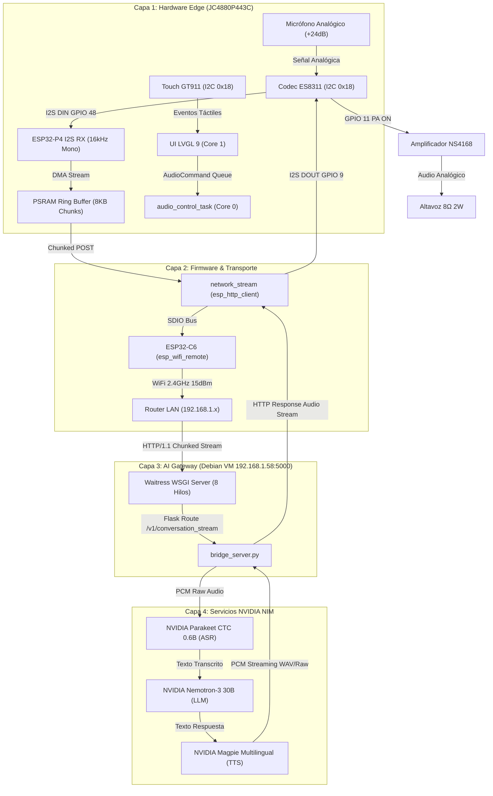

# 🏛️ Arquitectura de Sistema: Edge AI Voice Assistant

**Framework:** ESP-IDF v5.3.2 LTS Nativo + FreeRTOS + LVGL 9  
**Hardware:** ESP32-P4 (Host) + ESP32-C6 (WiFi SDIO) + ES8311 + ST7701S  
**AI Gateway:** Debian 13 VM (Proxmox `192.168.1.58:5000`) + Waitress WSGI  
**Cloud AI:** NVIDIA NIM (Parakeet ASR + Nemotron LLM + Magpie TTS)  

---

## 1. Topología del Sistema (4 Capas de Aislamiento)

---

## 2. Asignación Concurrente de Núcleos (FreeRTOS)

| Núcleo | Tareas Asignadas | Responsabilidades | Prioridad |
|---|---|---|---|
| **Core 1 (App Core)** | `lvgl_task` | Motor gráfico LVGL 9, eventos táctiles GT911, animaciones a 60 FPS con Double Buffer en PSRAM. | 4 |
| **Core 0 (Pro Core)** | `afe_fetch` (I2S RX), `audio_ctrl`, `esp_wifi_remote`, `network_stream` | Captura DMA de audio, streaming HTTP/1.1 chunked, comunicación SDIO con el coprocesador C6, recepción de audio TTS y reproducción I2S TX. | 5 (Alta) |

---

## 3. Filosofía de Memoria y Rendimiento
1. **Buffers en PSRAM:** Los buffers de captura de audio (`8192 bytes` por chunk) y renderizado gráfico se alojan en **PSRAM externa (32MB)** con `heap_caps_malloc(..., MALLOC_CAP_SPIRAM)`.
2. **Protección de SRAM Interno:** La memoria interna SRAM se reserva para DMA y descriptores de alta velocidad, evitando la fragmentación del heap.
3. **Comunicación Thread-Safe:** La UI y el subsistema de audio se comunican exclusivamente mediante colas de FreeRTOS (`audioCommandQueue`), sin llamadas directas no sincronizadas entre núcleos.
