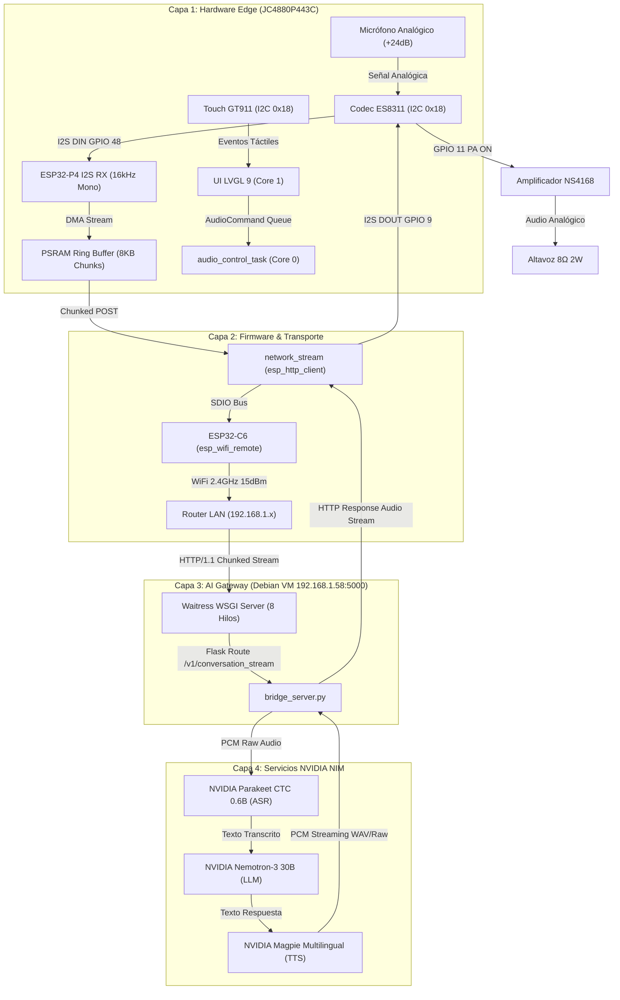

# 📘 Bitácora de Evolución del Sistema & Post-Mortem de Ingeniería
## Proyecto: Edge AI Voice Assistant (ESP32-P4 + Debian AI Gateway)

**Rol:** Chief AI Engineering Officer (CAEO)  
**Hardware:** Guition JC4880P443C (ESP32-P4 Dual Core RISC-V 360/400MHz + ESP32-C6 Coprocesador WiFi/BT + Codec ES8311 + Display MIPI DSI ST7701S 4.43" 480x800 + Touch GT911)  
**Software Gateway:** Debian 13 (Proxmox VM `192.168.1.58`) + Python/Waitress + NVIDIA Cloud NIM (Parakeet ASR + Nemotron LLM + Magpie TTS)  
**Framework Firmware:** ESP-IDF v5.3.2 LTS Nativo + FreeRTOS + LVGL 9  

---

## 🗺️ 1. Diagrama de Evolución del Pipeline y Arquitectura



---

## ⏱️ 2. Línea Temporal de Evolución & Fases

| Fase | Enfoque Principal | Estado | Hitos Clave |
|---|---|---|---|
| **Fase 1** | Prototipo Rápido (Arduino Core) | Superada | Validación eléctrica básica, desbloqueo de registros ES8311, solución a cortes Brownout (BOD). |
| **Fase 2** | Migración a ESP-IDF Nativo v5.3 | Completada | Arquitectura FreeRTOS multicore, BSP oficial MIPI DSI, motor LVGL 9 con Double Buffer, soporte SDIO para C6. |
| **Fase 3** | Audio Pipeline Real & Streaming HTTP | En Validación Activa | Captura I2S directa en ESP-IDF v5, streaming HTTP chunked bidireccional, depuración de congestión de paquetes y sockets. |
| **Fase 4** | Optimización de Latencia y Voice VAD | Próxima | Implementación de VAD continuo / Wake Word local y reproducción por streaming reactivo sin bloqueo. |

---

## 🧱 3. Registro Detallado de Incidentes, Causas Raíz y Soluciones (Post-Mortem)

### 🔴 Incidente #1: Saturación del Micrófono (Saturación a 32767 / DC Offset)
- **Síntoma:** El audio capturado por el micrófono sólo producía ruido estático o muestras máximas saturadas (+32767).
- **Causa Raíz:** El micrófono de condensador inyecta un voltaje DC de polarización (*Mic Bias*). El filtro pasa-altos digital del ADC dentro del codec ES8311 estaba apagado por defecto en los registros de fábrica.
- **Solución de Ingeniería:** Configuración a nivel de registro I2C del chip ES8311:
  - Registro `0x1B = 0x0A` y `0x1C = 0x6A` (Activación del filtro HPF interno del ADC).
  - Configuración de ganancia analógica del preamplificador a +24dB (`0x17 = 0xBF`).

---

### 🔴 Incidente #2: Altavoz Mudo y Reinicios Eléctricos por Brownout (BOD)
- **Síntoma:** No salía sonido por el altavoz y, al intentar reproducir tonos fuertes, el ESP32 se reiniciaba repentinamente (`Brownout detector was triggered`).
- **Causa Raíz:** 
  1. El registro `0x32` (Volumen Digital del DAC) estaba inicializado en `0x00` (mute total).
  2. El pin físico de activación del amplificador de potencia (GPIO 11) no estaba energizado.
  3. Al activar el amplificador con volumen al máximo mientras el módulo WiFi transmitía a máxima potencia (20 dBm / 100 mW), los picos transitorios de corriente superaban los **850 mA**, hundiendo el riel de 3.3V entregado por los puertos USB de la PC.
- **Solución de Ingeniería:**
  - Control de GPIO 11 en nivel alto al arranque (`gpio_set_level(GPIO_NUM_11, 1)`).
  - Calibración del volumen del DAC a nivel seguro y no distorsionado (`0x32 = 0x80`).
  - Reducción de la potencia de RF de emisión WiFi a `15 dBm` (~31 mW), reduciendo el consumo un 35% sin degradar la recepción RSSI.

---

### 🔴 Incidente #3: Bloqueo de Conexión WiFi por Dirección MAC Nula
- **Síntoma:** El módulo WiFi STA no obtenía IP y el router rechazaba la asociación.
- **Causa Raíz:** En la arquitectura `esp-hosted` / `esp_wifi_remote`, la interfaz virtual STA heredaba una dirección MAC vacía `00:00:00:00:00:00` en lugar de la MAC quemada en los eFuses del hardware.
- **Solución de Ingeniería:** Extracción de la MAC por hardware en el arranque e inyección forzada con bit STA local antes de conectar:
  ```cpp
  uint8_t mac[6] = {0};
  if (esp_efuse_mac_get_default(mac) == ESP_OK) {
      mac[5] ^= 0x02; // Bit STA
      esp_wifi_set_mac(WIFI_IF_STA, mac);
  }
  ```

---

### 🔴 Incidente #4: Error `swap_xy` y Renderizado en Pantalla MIPI DSI
- **Síntoma:** La inicialización de la pantalla fallaba con `esp_lcd_panel_swap_xy: not supported by this panel`.
- **Causa Raíz:** El panel MIPI DSI ST7701S en hardware no admite trasposición de coordenadas a nivel de registro del controlador de pantalla.
- **Solución de Ingeniería:** Delegar la rotación y el manejo de orientación a la capa de software de **LVGL 9** y al subsistema DMA/PPA del ESP32-P4, evitando llamadas no soportadas a nivel del driver del panel.

---

### 🔴 Incidente #5: Error `Content-Length: -1` y Rechazo de Conexión HTTP
- **Síntoma:** Al oprimir el botón táctil, el ESP32 arrojaba `Connection reset by peer` instantáneamente al conectar con `http://192.168.1.58:5000/v1/conversation_stream`.
- **Causa Raíz:** Se estaba llamando a `esp_http_client_set_post_field(client, NULL, -1)`. En ESP-IDF v5, pasar `-1` como `size_t` en esa función calcula un valor entero sin signo de `4294967295`, emitiendo la cabecera `Content-Length: 4294967295`. El servidor WSGI Waitress rechazaba la conexión por desbordamiento de tamaño esperado.
- **Solución de Ingeniería:** 
  - Eliminar `esp_http_client_set_post_field`.
  - Habilitar el modo *Chunked Transfer Encoding* de forma nativa pasando `-1` directamente en la llamada de apertura `esp_http_client_open(client, -1)`.

---

### 🔴 Incidente #6: Incompatibilidad de Payload en el Bridge Server
- **Síntoma:** El endpoint `/v1/conversation_stream` en `bridge_server.py` no procesaba el audio binario directo.
- **Causa Raíz:** El servidor Flask esperaba un formulario multipart (`request.files['audio']`), mientras que el ESP32 envía un flujo binario continuo sin encapsular (`application/octet-stream`).
- **Solución de Ingeniería:** Actualización del servidor en Debian para leer el flujo de bytes directamente con `request.get_data()`, garantizando compatibilidad con streams de audio crudo PCM.

---

### 🔴 Incidente #7: Saturación de Paquetes de Red (Flooding de Chunks de 1024 Bytes)
- **Síntoma:** La conexión de audio se iniciaba correctamente pero se interrumpía exactamente a los 800 ms con `transport_base: poll_write select error 104, errno = Connection reset by peer`.
- **Causa Raíz:** El buffer de captura de I2S estaba seteado en 1024 bytes. A 16 kHz 16-bit Mono (32.000 bytes/segundo), el microcontrolador generaba **31.25 paquetes TCP por segundo**. El bus de comunicación SDIO entre el P4 y el coprocesador C6 (`esp_wifi_remote`) colapsaba por exceso de transacciones pequeñas, provocando un desbordamiento de colas y el cierre abrupto del socket.
- **Solución de Ingeniería:**
  - Aumento del tamaño del buffer de captura a **8192 bytes** (256 ms de audio por paquete), reduciendo la tasa de emisión a sólo **4 paquetes TCP por segundo**.
  - Implementación de `network_stream_abort()` para cerrar y limpiar el handle de `esp_http_client` si ocurre un error, evitando estados huérfanos `Connection already in progress`.

---

### 🔴 Incidente #8: Conflicto de Acceso Exclusivo al Puerto Serie (COM3)
- **Síntoma:** El comando de flasheo fallaba con `PermissionError(13, 'Acceso denegado')`.
- **Causa Raíz:** Terminales seriales externas (como PuTTY o monitores en segundo plano) mantenían el puerto `COM3` abierto bajo bloqueo exclusivo de Windows, impidiendo a `esptool.py` tomar control del chip.
- **Solución de Ingeniería / Procedimiento Operativo:** Cerrar siempre los monitores seriales antes de ejecutar `idf.py flash` o utilizar directamente el comando integrado `idf.py flash monitor`.

---

## 🏛️ 4. Decisiones de Arquitectura (ADRs Resumidos)

### ADR-001: Arquitectura de Streaming Chunked HTTP vs WebSockets / gRPC
- **Contexto:** Necesidad de enviar audio continuo desde el microcontrolador al servidor con la menor sobrecarga de memoria.
- **Decisión:** Utilizar **HTTP/1.1 Chunked Transfer Encoding** para la etapa de captura inicial por su simplicidad en el ESP32, migrando a **gRPC / WebSockets** en la Fase 4 cuando se requiera duplex completo interactivo (interrupción de voz / barge-in).
- **Consecuencias:** Menor consumo de RAM en el firmware y facilidad de depuración en el servidor.

### ADR-002: Separación de Núcleos en FreeRTOS
- **Contexto:** La interfaz gráfica LVGL no debe congelarse durante la captura de audio o las peticiones de red.
- **Decisión:**
  - **Core 1 (App Core):** Tarea exclusiva para el motor gráfico LVGL 9 con refresco a 5-10 ms.
  - **Core 0 (Pro Core):** Tareas de fondo: Audio I2S, WiFi, HTTP streaming y control de estados.
  - **Uso estricto del término de UI:** En todas las pantallas y opciones gráficas se usará invariablemente el término "configuración" (prohibido "ajustes").
- **Consecuencias:** Cero tartamudeo (stuttering) visual y respuesta fluida de la pantalla táctil.

### ADR-003: Asignación de Buffers de Audio en PSRAM
- **Contexto:** Los buffers de audio PCM requieren decenas de kilobytes.
- **Decisión:** Todos los buffers de captura y reproducción deben crearse mediante `heap_caps_malloc(..., MALLOC_CAP_SPIRAM)` o mantenerse como estructuras estáticas en PSRAM.
- **Consecuencias:** Cero fragmentación del SRAM interno (que queda 100% libre para DMA y pila de tareas de alta velocidad).

---

## 🎯 5. Estado Actual del Sistema y Próximos Pasos

```
[✅ Hardware & Display]  -->  [✅ Audio I2S & Codec]  -->  [⏳ Streaming LAN 4s]  -->  [✅ NVIDIA NIM Cloud]
   MIPI DSI + GT911             ES8311 + NS4168 Amp          8KB Chunks @ 16kHz        Parakeet + Nemotron + Magpie
```

1. **Prueba Inmediata:** Validar la ráfaga de 4 segundos con buffer de 8KB en el servidor Linux.
2. **Implementación de Recepción TTS:** Conectar la respuesta de audio recibida en `network_stream.cpp` hacia el canal TX de I2S en `audio_manager_play_chunk()` para que el asistente hable por el altavoz.
3. **Mantenimiento Continuo de la Bitácora:** Actualizar este documento tras cada hito validado en el hardware.
