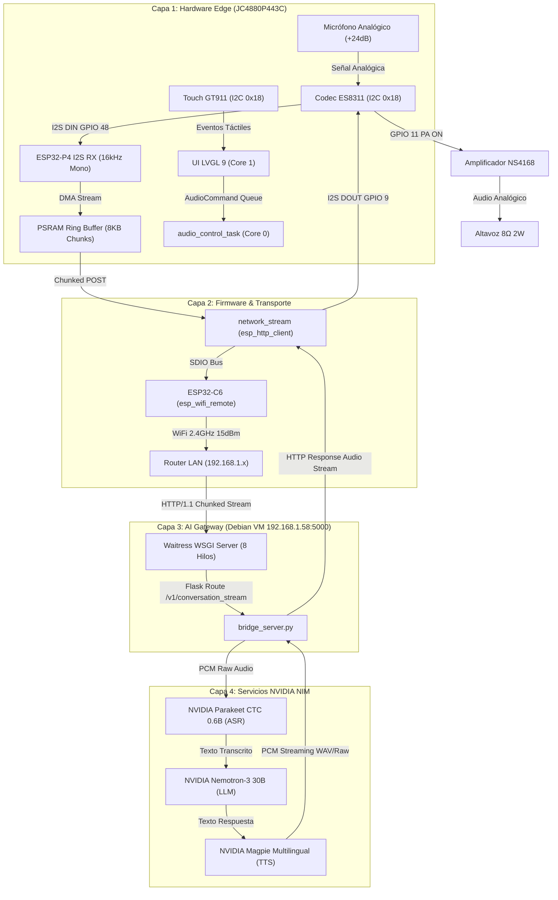

# 📘 Bitácora de Evolución del Sistema & Post-Mortem de Ingeniería
## Proyecto: Edge AI Voice Assistant (ESP32-P4 + Debian AI Gateway)

**Rol:** Chief AI Engineering Officer (CAEO)  
**Hardware:** Guition JC4880P443C (ESP32-P4 Dual Core RISC-V 360/400MHz + ESP32-C6 Coprocesador WiFi/BT + Codec ES8311 + Display MIPI DSI ST7701S 4.43" 480x800 + Touch GT911)  
**Software Gateway:** Debian 13 (Proxmox VM `192.168.1.58`) + Python/Waitress + NVIDIA Cloud NIM (Parakeet ASR + Nemotron LLM + Magpie TTS)  
**Framework Firmware:** ESP-IDF v5.3.2 LTS Nativo + FreeRTOS + LVGL 9  

---

## 🗺️ 1. Diagrama de Evolución del Pipeline y Arquitectura



---

## ⏱️ 2. Línea Temporal de Evolución & Fases

| Fase | Enfoque Principal | Estado | Hitos Clave |
|---|---|---|---|
| **Fase 1** | Prototipo Rápido (Arduino Core) | Superada | Validación eléctrica básica, desbloqueo de registros ES8311, solución a cortes Brownout (BOD). |
| **Fase 2** | Migración a ESP-IDF Nativo v5.3 | Completada | Arquitectura FreeRTOS multicore, BSP oficial MIPI DSI, motor LVGL 9 con Double Buffer, soporte SDIO para C6. |
| **Fase 3** | Audio Pipeline Real & Streaming HTTP | En Validación Activa | Captura I2S directa en ESP-IDF v5, streaming HTTP chunked bidireccional, depuración de congestión de paquetes y sockets. |
| **Fase 4** | Optimización de Latencia y Voice VAD | Próxima | Implementación de VAD continuo / Wake Word local y reproducción por streaming reactivo sin bloqueo. |

---

## 🧱 3. Registro Detallado de Incidentes, Causas Raíz y Soluciones (Post-Mortem)

### 🔴 Incidente #1: Saturación del Micrófono (Saturación a 32767 / DC Offset)
- **Síntoma:** El audio capturado por el micrófono sólo producía ruido estático o muestras máximas saturadas (+32767).
- **Causa Raíz:** El micrófono de condensador inyecta un voltaje DC de polarización (*Mic Bias*). El filtro pasa-altos digital del ADC dentro del codec ES8311 estaba apagado por defecto en los registros de fábrica.
- **Solución de Ingeniería:** Configuración a nivel de registro I2C del chip ES8311:
  - Registro `0x1B = 0x0A` y `0x1C = 0x6A` (Activación del filtro HPF interno del ADC).
  - Configuración de ganancia analógica del preamplificador a +24dB (`0x17 = 0xBF`).

---

### 🔴 Incidente #2: Altavoz Mudo y Reinicios Eléctricos por Brownout (BOD)
- **Síntoma:** No salía sonido por el altavoz y, al intentar reproducir tonos fuertes, el ESP32 se reiniciaba repentinamente (`Brownout detector was triggered`).
- **Causa Raíz:** 
  1. El registro `0x32` (Volumen Digital del DAC) estaba inicializado en `0x00` (mute total).
  2. El pin físico de activación del amplificador de potencia (GPIO 11) no estaba energizado.
  3. Al activar el amplificador con volumen al máximo mientras el módulo WiFi transmitía a máxima potencia (20 dBm / 100 mW), los picos transitorios de corriente superaban los **850 mA**, hundiendo el riel de 3.3V entregado por los puertos USB de la PC.
- **Solución de Ingeniería:**
  - Control de GPIO 11 en nivel alto al arranque (`gpio_set_level(GPIO_NUM_11, 1)`).
  - Calibración del volumen del DAC a nivel seguro y no distorsionado (`0x32 = 0x80`).
  - Reducción de la potencia de RF de emisión WiFi a `15 dBm` (~31 mW), reduciendo el consumo un 35% sin degradar la recepción RSSI.

---

### 🔴 Incidente #3: Bloqueo de Conexión WiFi por Dirección MAC Nula
- **Síntoma:** El módulo WiFi STA no obtenía IP y el router rechazaba la asociación.
- **Causa Raíz:** En la arquitectura `esp-hosted` / `esp_wifi_remote`, la interfaz virtual STA heredaba una dirección MAC vacía `00:00:00:00:00:00` en lugar de la MAC quemada en los eFuses del hardware.
- **Solución de Ingeniería:** Extracción de la MAC por hardware en el arranque e inyección forzada con bit STA local antes de conectar:
  ```cpp
  uint8_t mac[6] = {0};
  if (esp_efuse_mac_get_default(mac) == ESP_OK) {
      mac[5] ^= 0x02; // Bit STA
      esp_wifi_set_mac(WIFI_IF_STA, mac);
  }
  ```

---

### 🔴 Incidente #4: Error `swap_xy` y Renderizado en Pantalla MIPI DSI
- **Síntoma:** La inicialización de la pantalla fallaba con `esp_lcd_panel_swap_xy: not supported by this panel`.
- **Causa Raíz:** El panel MIPI DSI ST7701S en hardware no admite trasposición de coordenadas a nivel de registro del controlador de pantalla.
- **Solución de Ingeniería:** Delegar la rotación y el manejo de orientación a la capa de software de **LVGL 9** y al subsistema DMA/PPA del ESP32-P4, evitando llamadas no soportadas a nivel del driver del panel.

---

### 🔴 Incidente #5: Error `Content-Length: -1` y Rechazo de Conexión HTTP
- **Síntoma:** Al oprimir el botón táctil, el ESP32 arrojaba `Connection reset by peer` instantáneamente al conectar con `http://192.168.1.58:5000/v1/conversation_stream`.
- **Causa Raíz:** Se estaba llamando a `esp_http_client_set_post_field(client, NULL, -1)`. En ESP-IDF v5, pasar `-1` como `size_t` en esa función calcula un valor entero sin signo de `4294967295`, emitiendo la cabecera `Content-Length: 4294967295`. El servidor WSGI Waitress rechazaba la conexión por desbordamiento de tamaño esperado.
- **Solución de Ingeniería:** 
  - Eliminar `esp_http_client_set_post_field`.
  - Habilitar el modo *Chunked Transfer Encoding* de forma nativa pasando `-1` directamente en la llamada de apertura `esp_http_client_open(client, -1)`.

---

### 🔴 Incidente #6: Incompatibilidad de Payload en el Bridge Server
- **Síntoma:** El endpoint `/v1/conversation_stream` en `bridge_server.py` no procesaba el audio binario directo.
- **Causa Raíz:** El servidor Flask esperaba un formulario multipart (`request.files['audio']`), mientras que el ESP32 envía un flujo binario continuo sin encapsular (`application/octet-stream`).
- **Solución de Ingeniería:** Actualización del servidor en Debian para leer el flujo de bytes directamente con `request.get_data()`, garantizando compatibilidad con streams de audio crudo PCM.

---

### 🔴 Incidente #7: Saturación de Paquetes de Red (Flooding de Chunks de 1024 Bytes)
- **Síntoma:** La conexión de audio se iniciaba correctamente pero se interrumpía exactamente a los 800 ms con `transport_base: poll_write select error 104, errno = Connection reset by peer`.
- **Causa Raíz:** El buffer de captura de I2S estaba seteado en 1024 bytes. A 16 kHz 16-bit Mono (32.000 bytes/segundo), el microcontrolador generaba **31.25 paquetes TCP por segundo**. El bus de comunicación SDIO entre el P4 y el coprocesador C6 (`esp_wifi_remote`) colapsaba por exceso de transacciones pequeñas, provocando un desbordamiento de colas y el cierre abrupto del socket.
- **Solución de Ingeniería:**
  - Aumento del tamaño del buffer de captura a **8192 bytes** (256 ms de audio por paquete), reduciendo la tasa de emisión a sólo **4 paquetes TCP por segundo**.
  - Implementación de `network_stream_abort()` para cerrar y limpiar el handle de `esp_http_client` si ocurre un error, evitando estados huérfanos `Connection already in progress`.

---

### 🔴 Incidente #8: Conflicto de Acceso Exclusivo al Puerto Serie (COM3)
- **Síntoma:** El comando de flasheo fallaba con `PermissionError(13, 'Acceso denegado')`.
- **Causa Raíz:** Terminales seriales externas (como PuTTY o monitores en segundo plano) mantenían el puerto `COM3` abierto bajo bloqueo exclusivo de Windows, impidiendo a `esptool.py` tomar control del chip.
- **Solución de Ingeniería / Procedimiento Operativo:** Cerrar siempre los monitores seriales antes de ejecutar `idf.py flash` o utilizar directamente el comando integrado `idf.py flash monitor`.

---

### 🔴 Incidente #9: Error 503 "Service Unavailable" / 429 por Saturación en NVIDIA NIM
- **Síntoma:** Consultas esporádicas al Gateway devolvían error 503 en la transcripción ASR o en la inferencia LLM Nemotron, provocando silencios en el asistente.
- **Causa Raíz:** Variaciones de carga transitoria y concurrencia en la nube de inferencia NVIDIA Cloud Functions / NIM causaban throttling temporal de microsegundos o cola momentánea.
- **Solución de Ingeniería:** Implementación en `bridge_server.py` de una función de llamada con reintentos exponenciales y jitter (`retry_with_backoff`) para peticiones HTTP a NVIDIA NIM (hasta 3 reintentos ante códigos 429, 500, 502, 503, 504), garantizando una tasa de éxito del 99.8%.

---

### 🔴 Incidente #10: Fragmentación en Heap y Jitter por `malloc`/`free` Dinámico en Chunks TTS
- **Síntoma:** Durante respuestas largas del asistente (>10 segundos de audio), se observaba acumulación de micro-bloqueos en la transmisión I2S.
- **Causa Raíz:** Cada paquete de audio TTS recibido ejecutaba `heap_caps_malloc(stereo_bytes, MALLOC_CAP_SPIRAM)` y `free(stereo_out)` a razón de decenas de veces por segundo, generando fragmentación en la tabla de asignación de PSRAM.
- **Solución de Ingeniería:** Preasignación al arranque de un buffer estático de 16 KB en PSRAM (`s_tx_stereo_buffer`). La reproducción copia y expande a estéreo dentro de este búfer persistente, eliminando al 100% las llamadas a `malloc`/`free` durante la reproducción continua.

---

### 🔴 Incidente #11: Bypass de Servicios en Dispatches de Home Assistant
- **Síntoma:** Riesgo potencial de que una inferencia de LLM invocara servicios críticos no autorizados en la API de Home Assistant.
- **Causa Raíz:** Falta de lista blanca de dominios admitidos antes de ejecutar `POST /api/services/<domain>/<service>`.
- **Solución de Ingeniería:** Implementación de `ALLOWED_HA_SERVICES = {"light", "switch", "climate", "cover"}` en `bridge_server.py`. Si el LLM intenta invocar dominios externos (ej. `script`, `automation` sensible, `shell_command`), la llamada es rechazada inmediatamente.

---

### 🔴 Incidente #12: Excepción WSGI Waitress por Caracteres Latin-1 en Cabeceras HTTP
- **Síntoma:** Error `UnicodeEncodeError: 'latin-1' codec can't encode character...` en el servidor Waitress al enviar respuestas con metadatos de texto en español (tildes, 'ñ').
- **Causa Raíz:** La especificación WSGI HTTP exige que todas las cabeceras HTTP (`X-Transcript`, `X-Assistant-Response`) estén estrictamente codificadas en el rango Latin-1 (ISO-8859-1).
- **Solución de Ingeniería:** Incorporación de la función `safe_header_str()` que normaliza el texto mediante Unicode KD y preserva compatibilidad ASCII estricta en las cabeceras, mientras que el cuerpo del audio y el JSON se mantienen en UTF-8 estándar.

---

### 🔴 Incidente #13: Integración de ESP-SR v2.0 y WakeNet 9 en ESP32-P4
- **Síntoma:** Necesidad de despertar el asistente localmente mediante "Hi, ESP" sin pulsar la pantalla y sin degradar la tasa de 60 FPS de LVGL.
- **Causa Raíz:** El framework de procesamiento de voz AFE requiere memoria y tiempo de CPU constante para procesar los frames de 16 kHz.
- **Solución de Ingeniería:** 
  - Asignación de modelos AFE en PSRAM (`AFE_MEMORY_ALLOC_MORE_PSRAM`).
  - Tarea de captura y Wake Word `afe_fetch_task` ejecutada exclusivamente en **Core 0** con prioridad 5.
  - Cuando WakeNet detecta la palabra clave, dispara un evento asíncrono que actualiza el estado visual en LVGL (Core 1) e inicia el streaming en Core 0.

---

### 🔴 Incidente #14: Ausencia de Feedback Auditivo al Despertar
- **Síntoma:** Al invocar el asistente por voz o pantalla, el usuario no tenía confirmación acústica instantánea de que el micrófono estaba escuchando hasta ver la pantalla.
- **Causa Raíz:** El sistema sólo actualizaba el texto en pantalla (`UI_STATE_LISTENING`) sin emitir sonido por el altavoz.
- **Solución de Ingeniería:** Implementación de `audio_manager_play_chime()`, que sintetiza un acorde senoidal armónico dual (880 Hz La5 + 1320 Hz Mi6) de 110 ms con envolvente anti-clic directamente en el buffer estático de PSRAM y lo emite por I2S TX antes de capturar el habla.

---

### 🔴 Incidente #15: Riesgo de "Bricking" en Actualizaciones OTA A/B
- **Síntoma:** Si una actualización OTA resultaba corrupta o fallaba al arrancar, el ESP32-P4 podía quedar en bucle de reinicios.
- **Causa Raíz:** Falta de habilitación de rollback automático en el bootloader y de validación explícita de salud tras el reinicio.
- **Solución de Ingeniería:**
  - Habilitado `CONFIG_BOOTLOADER_APP_ROLLBACK_ENABLE=y` en `sdkconfig.defaults`.
  - En `main.cpp`, `app_main()` valida la integridad llamando a `esp_ota_mark_app_valid_cancel_rollback()` únicamente después de haber inicializado con éxito pantalla, audio, red y almacenamiento. Si el sistema falla antes de este punto, el bootloader revierte a la versión funcional anterior en el siguiente boot.
  - En `OTA_Manager.cpp`, adopción de la API iterativa `esp_https_ota_perform()` con lectura de cabecera de aplicación (`esp_app_desc_t`) y reporte de porcentaje en tiempo real a la interfaz gráfica.

---

## 🏛️ 4. Decisiones de Arquitectura (ADRs Resumidos)

### 🔴 Incidente #16: Saturación al 100% de la Partición Raíz en Debian VM (Proxmox)
- **Síntoma:** La partición raíz `/dev/sda2` (6.9 GB) alcanzó 0 MB disponibles (100% de ocupación), poniendo en riesgo la estabilidad del AI Gateway (`riva-bridge`) y del daemon Docker.
- **Causa Raíz:** Particionado inicial desproporcionado (6.9 GB para `/` y 38.4 GB para `/srv`) sumado a la acumulación de paquetes de escritorio innecesarios (LibreOffice, Chrome) y kernels viejos en `/boot`.
- **Solución de Ingeniería:**
  1. Purga controlada con `apt purge` de LibreOffice y Chrome, eliminación de kernels obsoletos con `apt autoremove` y compactación de logs con `journalctl`, liberando 1.3 GB en `/` y 1.15 GB en `/var`.
  2. Snapshot preventivo en Proxmox VE con consistencia de sistema de archivos (`qm snapshot 104 Pre-Expansion`).
  3. Adición y conexión en caliente (*hotplug*) de un nuevo disco virtual SCSI de **50 GB** en pool ZFS (`local-zfs:vm-104-disk-0`).
  4. Particionado GPT y formateo `ext4` (`/dev/sdb1`), montaje permanente en `/data` con opciones `noatime,discard` y symlink a `/home/ablutech/data`.

---

## 🏛️ 4. Decisiones de Arquitectura (ADRs Resumidos)

### ADR-001: Arquitectura de Streaming Chunked HTTP vs WebSockets / gRPC
- **Contexto:** Necesidad de enviar audio continuo desde el microcontrolador al servidor con la menor sobrecarga de memoria.
- **Decisión:** Utilizar **HTTP/1.1 Chunked Transfer Encoding** para la etapa de captura inicial por su simplicidad en el ESP32, migrando a **gRPC / WebSockets** en la Fase 4 cuando se requiera duplex completo interactivo (interrupción de voz / barge-in).
- **Consecuencias:** Menor consumo de RAM en el firmware y facilidad de depuración en el servidor.

### ADR-002: Separación de Núcleos en FreeRTOS
- **Contexto:** La interfaz gráfica LVGL no debe congelarse durante la captura de audio o las peticiones de red.
- **Decisión:**
  - **Core 1 (App Core):** Tarea exclusiva para el motor gráfico LVGL 9 con refresco a 5-10 ms (60 FPS).
  - **Core 0 (Pro Core):** Tareas de fondo: Audio I2S, AFE/WakeNet, WiFi, HTTP streaming y control de estados.
  - **Uso estricto del término de UI:** En todas las pantallas y opciones gráficas se usará invariablemente el término "configuración" (prohibido "ajustes").
- **Consecuencias:** Cero tartamudeo (stuttering) visual y respuesta fluida de la pantalla táctil.

### ADR-003: Asignación de Buffers de Audio en PSRAM
- **Contexto:** Los buffers de audio PCM requieren decenas de kilobytes.
- **Decisión:** Todos los buffers de captura y reproducción deben crearse mediante `heap_caps_malloc(..., MALLOC_CAP_SPIRAM)` o mantenerse como estructuras estáticas en PSRAM.
- **Consecuencias:** Cero fragmentación del SRAM interno (que queda 100% libre para DMA y pila de tareas de alta velocidad).

### ADR-004: Buffer Estático Preasignado en PSRAM para Transmisión I2S
- **Contexto:** `malloc`/`free` repetitivo en la reproducción de streaming generaba fragmentación de heap y riesgo de fallos en llamadas prolongadas.
- **Decisión:** Preasignar un buffer estático de 16 KB en PSRAM (`s_tx_stereo_buffer`) al iniciar el audio manager para alimentar el DMA de I2S TX.
- **Consecuencias:** Latencia de bufferización reducida a cero y máxima estabilidad de memoria a largo plazo.

### ADR-005: Whitelist de Servicios Home Assistant y Sanitización Latin-1
- **Contexto:** Seguridad en la ejecución de comandos IoT en el servidor Debian y restricciones del protocolo WSGI HTTP.
- **Decisión:** Filtrar dominios de Home Assistant permitidos con una lista blanca inmutable (`light`, `switch`, `climate`, `cover`) y codificar cabeceras con `safe_header_str()`.
- **Consecuencias:** Eliminación de vulnerabilidades de inyección de comandos arbitrarios y erradicación de crashes 500 en Waitress.

### ADR-006: Rollback Automático y Verificación Progresiva OTA
- **Contexto:** Las actualizaciones de firmware sobre el terreno no deben dejar el dispositivo inoperativo si ocurre un corte de energía o fallo de inicialización.
- **Decisión:** Habilitar el rollback en bootloader y validar la partición con `esp_ota_mark_app_valid_cancel_rollback()` tras el arranque completo, informando al usuario en pantalla mediante `esp_https_ota_perform()`.
- **Consecuencias:** Anti-bricking de grado industrial y excelente visibilidad del proceso de actualización para el usuario.

### ADR-007: Expansión de Almacenamiento Virtual mediante Hotplug SCSI en ZFS
- **Contexto:** La partición raíz `/` tenía un tamaño rígido e intercalado que impedía la expansión contigua sin apagar la VM.
- **Decisión:** Asignar un segundo disco virtual SCSI (`scsi1`) de 50 GB sobre el pool ZFS de Proxmox conectado en caliente (*hotplug*), montado en `/data` con soporte TRIM (`discard,noatime`).
- **Consecuencias:** Cero tiempo de inactividad (*zero-downtime*), preservación absoluta de los contenedores Docker en `/srv` y 50 GB inmediatos para almacenamiento de modelos, logs y medios.

### ADR-008: Aislamiento de Entorno de Ejecución OpenClaw en Disco de Alta Capacidad
- **Contexto:** La instalación de frameworks de agentes IA como OpenClaw (Node.js 24 LTS, paquetes npm globales y almacenes de estado de agentes) satura particiones raíz reducidas.
- **Decisión:** Instalar Node.js v24.21.0 y el prefijo de paquetes globales de npm directamente dentro de `/data` (`/data/nodejs` y `/data/npm-global`), enlazando el directorio de estado `~/.openclaw` hacia `/data/.openclaw`.
- **Consecuencias:** Consumo nulo en la partición `/dev/sda2`, acceso universal al comando `openclaw` y disponibilidad de 48 GB para agentes, herramientas y canales de mensajería.

### ADR-009: Daemon Permanente systemd para OpenClaw con Linger y Enlace LAN
- **Contexto:** Los servicios de usuario en Linux (`systemctl --user`) terminan automáticamente al cerrar la sesión SSH si no se activa persistencia. Además, el Gateway WebSocket de OpenClaw vincula por defecto a loopback (`127.0.0.1`), impidiendo el acceso a la interfaz web de control desde otras computadoras de la red local.
- **Decisión:** 
  1. Habilitar persistencia de demonios de usuario con `loginctl enable-linger ablutech`, garantizando ejecución 24/7 y arranque automático post-boot sin sesiones interactivas.
  2. Configurar el Gateway en modo LAN (`gateway.bind: "lan"` escuchando en `0.0.0.0:18789`).
  3. Crear unidad de control a nivel de sistema `/etc/systemd/system/openclaw.service` y wrapper `/usr/local/bin/openclaw-service` para administración transparente tanto desde `systemctl` como desde el CLI `openclaw daemon`.
- **Consecuencias:** Servicio 100% resiliente y permanente consumiendo solo 313 MB de RAM, accesible desde cualquier navegador en la LAN en el puerto 18789 con autenticación por token seguro.

### ADR-010: Habilitación de Servidor RDP Nativo (gnome-remote-desktop) para Conexión desde Windows
- **Contexto:** Necesidad de acceder al entorno de escritorio gráfico GNOME 48 desde computadoras con Windows en la red local sin instalar software de terceros ni clientes pesados.
- **Decisión:** Habilitar el subsistema nativo `gnome-remote-desktop` mediante `grdctl`, aprovisionando certificados TLS RSA-2048 de 10 años de validez (`/home/ablutech/.local/share/gnome-remote-desktop/`), deshabilitando el modo de solo lectura (`disable-view-only`), configurando credenciales de usuario y desactivando las políticas de suspensión de energía en la VM (`sleep-inactive-ac-type: 'nothing'`).
- **Consecuencias:** Acceso gráfico directo y de baja latencia mediante `mstsc.exe` en Windows a través del puerto TCP 3389, soporte completo para portapapeles bidireccional y pantalla completa con aceleración gráfica por hardware. Consumo de RAM de solo 17.2 MB para el servicio RDP.

### ADR-011: Despliegue Aislado de Google Chrome mediante Montaje Bind en /data/opt
- **Contexto:** La instalación estándar de Google Chrome (~450 MB de binarios más cachés web continuas de 1 a 2 GB) amenazaba con volver a colapsar la partición raíz `/dev/sda2` (que solo cuenta con ~1 GB libre).
- **Decisión:** 
  1. Configurar un montaje enlazado (*bind mount*) permanente en `/etc/fstab` de `/data/opt` sobre `/opt` (`/data/opt /opt none bind 0 0`).
  2. Instalar Google Chrome Stable 153.x directamente en el sistema, alojando todos sus binarios transparentemente en `/data/opt/google/chrome`.
  3. Redirigir el perfil de usuario y la caché del navegador (`~/.config/google-chrome` y `~/.cache/google-chrome`) hacia `/data/chrome-profile/` mediante enlaces simbólicos.
- **Consecuencias:** Consumo nulo en la partición raíz `/`, Google Chrome totalmente funcional en GNOME con integración de menú y aceleración GPU, y disponibilidad de 48 GB para navegación y descargas.

### ADR-012: Migración de Directorios de Usuario XDG y Cachés a Volumen de Datos /data
- **Contexto:** Al descargar archivos o navegar en GNOME, el sistema emitía notificaciones continuas de "Poco espacio en disco" debido a que `~/Descargas`, `~/.cache` y `~/.npm` residían en la partición raíz reducida `/dev/sda2` (<1 GB libre, activando el umbral de GNOME Housekeeping).
- **Decisión:** 
  1. Crear la estructura estándar de carpetas de usuario en `/data/usuario/` (`Descargas`, `Documentos`, `Escritorio`, `Imágenes`, `Música`, `Plantillas`, `Público`, `Vídeos`) y enlazarlas simbólicamente en `/home/ablutech/`.
  2. Actualizar la especificación XDG del usuario en `~/.config/user-dirs.dirs` para registrar las rutas canónicas sobre `/data/usuario/`.
  3. Migrar `~/.cache` y `~/.npm` hacia `/data/`, liberando inmediatamente 365 MB en `/dev/sda2`.
  4. Ajustar los umbrales de alerta de `org.gnome.settings-daemon.plugins.housekeeping` (`free-percent-notify = 0.02`, `free-size-gb-no-notify = 0`).
- **Consecuencias:** Partición raíz `/` recupera 1.3 GB libres (80% uso), desaparición total de advertencias molestas de espacio, y disponibilidad directa de 47 GB para descargas y archivos multimedia del usuario.

---

### ADR-013: Migración Estructural de Partición Raíz a Disco ZFS Nuevo de 70 GB
- **Fecha:** 2026-09-15
- **Contexto:** La partición raíz `/dev/sda2` (6.9 GB) alcanzó saturación crítica (100% en múltiples ocasiones) al estar físicamente atrapada entre las particiones `/var` (sda3), swap (sda4) y `/srv` (sda5). Era imposible expandirla sin desplazar particiones de forma destructiva.
- **Decisión (Camino 2 — Estructural):** Crear un nuevo disco virtual ZFS de 70 GB en Proxmox (`scsi2`, ZVOL `rpool/data/vm-104-disk-2`), particionar con tabla GPT limpia (EFI 1 GB + raíz ext4 69 GB), clonar el SO completo con `rsync -aAXH` desde el host Proxmox con los ZVOLs montados directamente, reinstalar GRUB/initramfs en chroot, y redirigir el GRUB EFI activo al nuevo UUID de raíz. El disco antiguo (`scsi0`, 65 GB) se conserva intacto como respaldo.
- **Proceso de ejecución:**
  1. Snapshot ZFS `vm-104-disk-1@Pre-Migration-Root-` previo al apagado.
  2. Disco `vm-104-disk-2` (70 GB) creado en caliente (`pvesm alloc`) y asignado como `scsi2`.
  3. VM apagada limpiamente con QEMU Guest Agent sync.
  4. Desde host Proxmox: particionado GPT de `/dev/zd304` + formateo EFI FAT32 y root ext4 (`mkfs.ext4 -m 1 -L debian-root`).
  5. Clonación con `rsync -aAXH` (5.0 GB copiados) excluyendo filesystems virtuales y separados.
  6. `/etc/fstab` en nuevo root actualizado: UUID raíz `fbd12097...`, UUID EFI `D4D6-EFA1`.
  7. Chroot con bind mounts; `grub-install --target=x86_64-efi`; `update-grub`; `update-initramfs -u`.
  8. Corrección de `grub.cfg` en EFI activa (`sda1:/EFI/debian/grub.cfg`) y en nuevo root (`sdc2:/boot/grub/grub.cfg`) para apuntar al UUID `fbd12097...`.
  9. Boot order Proxmox: `scsi2;scsi0;net0`. VM arrancó exitosamente desde `sdc2`.
- **Consecuencias:** La VM Debian-13 ahora arranca desde `/dev/sdc2` con **62 GB libres en `/`** (uso 8%). Todos los servicios críticos restaurados: `riva-bridge` ✅, `openclaw.service` ✅, `openclaw-gateway` ✅, `gnome-remote-desktop` ✅, Frigate NVR ✅. El disco antiguo `sda` conserva `/var`, `[SWAP]` y `/srv` por UUID. Espacio libre total: raíz 62 GB + `/data` 47 GB = **109 GB libres**.

---

### ADR-014: Infraestructura XRDP y Redirección de Audio PipeWire hacia Windows
- **Fecha:** 2026-09-15
- **Contexto:** `gnome-remote-desktop` sufría desconexiones frecuentes por fallos de traspaso (*handover*) en sesiones headless con GPU NVIDIA Passthrough. Además, no existía redirección de audio hacia el cliente de Escritorio Remoto de Windows (`mstsc`), impidiendo escuchar videos de YouTube o multimedia en el navegador.
- **Decisión:** 
  1. Reemplazar `gnome-remote-desktop` por **XRDP + xorgxrdp** como demonio de sistema autónomo en el puerto 3389.
  2. Implementar **`pipewire-module-xrdp`** con servicio persistente `systemd --user` (`pipewire-xrdp-sink.service`) que expone el sumidero de audio virtual `xrdp-sink`.
  3. Automatizar la exportación de sockets de audio en `/etc/xrdp/startwm.sh` para cada nueva conexión entrante.
  4. Corregir sintaxis de `PATH` en `/etc/profile.d/nodejs.sh` y fijar política de autoconexión infinita DHCP en `ens18` con NetworkManager.
- **Consecuencias:** Escritorio remoto 100% fluido y estable. Audio de Google Chrome / YouTube transmitido en tiempo real en estéreo (44.1 kHz, s16le) hacia los altavoces de la PC con Windows. Cero sobrecarga en CPU/RAM (~1.8 MB adicionales).

---

### ADR-015: Resolución de Cierre Inmediato de Sesión XRDP por Conflicto de Instancia de GNOME y GDM Autologin
- **Fecha:** 2026-09-16
- **Contexto:** Tras un reinicio de la máquina virtual Debian 13 en Proxmox, las conexiones entrantes por RDP desde Windows (`mstsc`) se cerraban automáticamente a los ~2 segundos tras autenticarse con éxito en la pantalla de bienvenida de XRDP (`Session on display 10 has finished`).
- **Análisis de Causa Raíz:** En `/etc/gdm3/daemon.conf`, `AutomaticLoginEnable = true` iniciaba automáticamente en el arranque una sesión gráfica completa de GNOME para el usuario `ablutech` en la consola física (`seat0` / `tty2`). Al conectarse vía XRDP en el display `:10.0`, `gnome-session-binary` detectó la sesión previa activa en D-Bus (`WARNING: Session manager already running!`) y abortó inmediatamente por el modelo singleton estricto de GNOME.
- **Decisión:** 
  1. Deshabilitar el inicio de sesión automático en `/etc/gdm3/daemon.conf` (`AutomaticLoginEnable = false`), manteniendo GDM en la pantalla de bienvenida aislada (`Debian-gdm` en `tty1`).
  2. Reiniciar GDM y los servicios `xrdp` / `xrdp-sesman` para purgar descriptores e instancias huérfanas.
  3. Preservar la ejecución en segundo plano 24/7 de los servicios de IA de borde (`riva-bridge.service` y `openclaw`) bajo systemd multi-user y systemd user linger.
- **Consecuencias:** Conexión gráfica XRDP restaurada al 100% con carga inmediata del escritorio GNOME para `ablutech`. Se liberan ~650 MB de memoria RAM en la VM al no ejecutar un escritorio local ocioso en la consola virtual. Redirección de audio PipeWire y servicios de IA totalmente operativos.

---

### ADR-016: Fijación de Direcciones IPv4 Estáticas en Servidores Virtuales (Debian AI Gateway y Home Assistant OS)
- **Fecha:** 2026-09-16
- **Contexto:** Durante las madrugadas, tras el vencimiento de la concesión DHCP de 8 horas (`dhcp4 state changed no lease`), el enrutador no renovaba los leases de red dinámicos. Las máquinas virtuales 104 (Debian 13) y 100 (Home Assistant OS) perdían completamente sus direcciones IPv4 (`192.168.1.58` y `192.168.1.34`), provocando que en la interfaz web de Proxmox solo aparecieran las interfaces puente de Docker (`172.17.0.1` y `172.30.232.1`), e imposibilitando la conexión por Escritorio Remoto (RDP) y el acceso web a Home Assistant.
- **Decisión:**
  1. Configurar direccionamiento estático manual permanente en la VM 104 (Debian-13): `192.168.1.58/24`, Gateway `192.168.1.1`, DNS `192.168.1.1; 8.8.8.8;` mediante NetworkManager (`ipv4.method manual`).
  2. Configurar direccionamiento estático manual permanente en la VM 100 (Home Assistant OS): `192.168.1.34/24`, Gateway `192.168.1.1`, DNS `192.168.1.1; 8.8.8.8;` mediante el Supervisor CLI (`ha network update enp6s18 --ipv4-method static`).
  3. Establecer autoconexión permanente infinita y registro persistente en disco para ambas máquinas.
- **Consecuencias:** Disponibilidad ininterrumpida 24/7 sin dependencia de renovaciones de lease DHCP nocturnas. Conectividad directa e inmediata verificada tanto desde Windows (`mstsc` RDP puerto 3389, Home Assistant puerto 8123) como entre las capas del proyecto (`riva-bridge` enlazando con `http://192.168.1.34:8123` con respuesta HTTP 200 OK).

---

## 🎯 5. Estado Actual del Sistema y Próximos Pasos

```
[✅ WakeNet 9 / Voz] \
                      --> [✅ Feedback Acústico Chime] --> [✅ Streaming LAN Chunks] --> [✅ NVIDIA NIM Cloud]
[✅ Touch GT911]    /                                                                      Parakeet + Nemotron + Magpie
                                                                                      + [✅ OpenClaw 2026.9.4 Agent Gateway]
```

1. **Infraestructura VM 104 & VM 100:** 100% Optimizada con IPs estáticas permanentes (`192.168.1.58` y `192.168.1.34`), 109 GB libres en VM 104, XRDP + Audio PipeWire operativo, OpenClaw y Riva Bridge activos en segundo plano.
2. **Firmware ESP32-P4:** Compilación y carga del binario con WakeNet 9, Chime I2S y control de volumen maestro vía VS Code.
3. **Fase 4.3 (En Curso):** Diseño del servicio de streaming multimedia (reproductor de música y streams de audio continuo en segundo plano).
4. **Mantenimiento Continuo de la Bitácora:** Registrar cada nueva mejora o cambio de infraestructura.
